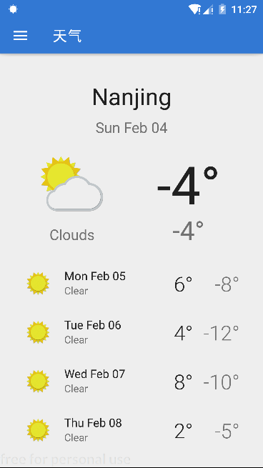

### SunBoard ,一个信息聚合App

- 首页分为四大模块，包括：天气、新闻、电影和图片。而天气模块可展示未来7天天气预报；新闻包括最近热点新闻、NBA、汽车和笑话；电影包括豆瓣TOP250。

- 首页界面风格采用Material Design设计规范，使用了tablayout和viewpager配合，viewpager切换fragment，整体界面模仿了网易新闻。

- 天气板块数据采用ContentProvider + LoaderManager框架。

- 抽屉导航栏采用的是DrawerLayout和NavigationView配合，使用的icon来自[Material Design Icon](https://design.google.com/icons/index.html)。

### Screenshot

<a href="screenshot/weather.png"></a> <a href="screenshot/news.png"></a>

<a href="screenshot/images.png"></a> <a href="screenshot/nav.png"></a>

<a href="screenshot/movies.png"></a> <a href="screenshot/settings.png"></a>


### 数据源
- 天气数据使用 [OpenWeatherMap](http://openweathermap.org/).
- 新闻数据来源于网易新闻.
- 电影数据来源[豆瓣API v2](https://developers.douban.com/wiki/?title=api_v2),归豆瓣所有.

### 依赖库
- [Glide](https://github.com/bumptech/glide)
- [OkHttp](https://github.com/square/okhttp)
- [Gson](https://github.com/google/gson)
- [PagerSlidingTabStrip](https://github.com/astuetz/PagerSlidingTabStrip)

### About Me
- Blog: [geelaro.github.com](http://geelaro.github.com)
- Email: [gmail](mailto:geelaro.li@gmail.com)

### License (MIT)

```
MTI LICENSE

Copyright (c) 2017 geelaro
```
